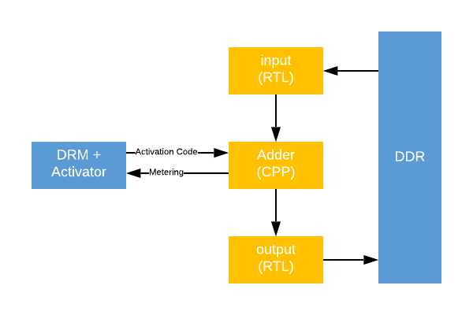

# Accelize Getting Started
## Xilinx Vitis example designs
### 02_hls_kernel

| Name                       | Description                                                      | Status      |
| -------------------------- |----------------------------------------------------------------- |:----------: |
| rtl_adder_pipes_c | Same design as Xilinx RTL adder but with HLS adder and DRM IPs | Tested OK with Xilinx Vitis 2019.2     |

# rtl_adder_pipes_c

